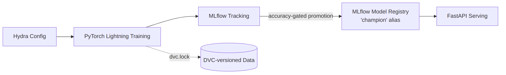
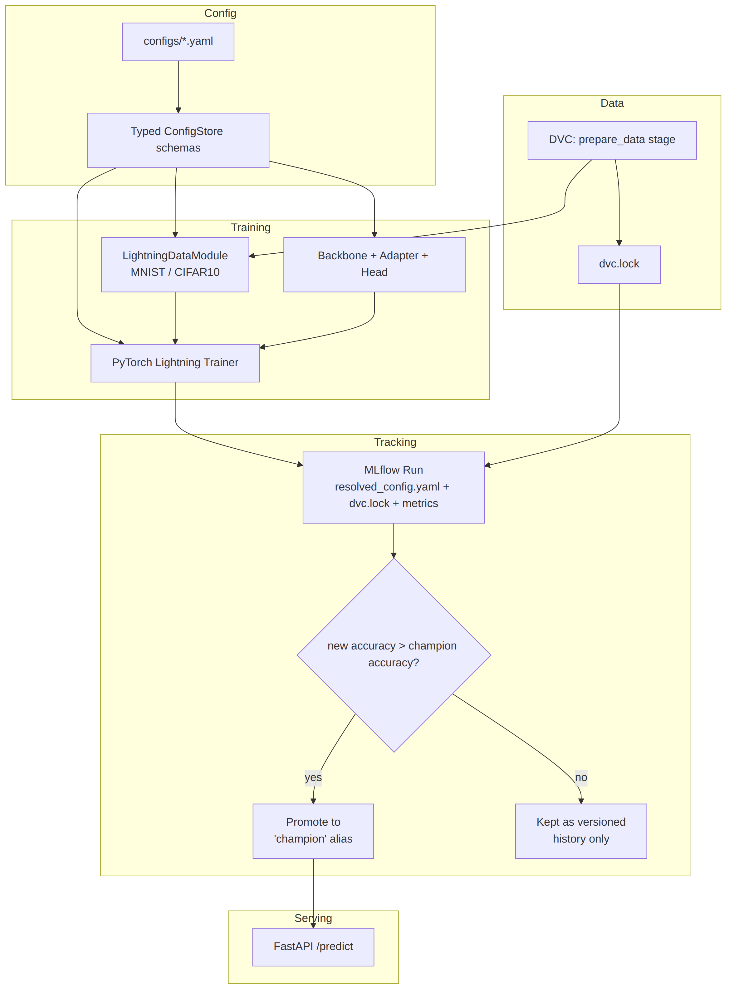

# Hydra Torch

**A modular, reproducible deep learning training framework** built with Hydra, PyTorch Lightning, MLflow, and DVC — designed for clean experiment management, structured configuration, and production-oriented ML workflows.

[](https://github.com/raselpy/hydra_torch/actions/workflows/ci.yml)
[](https://github.com/raselpy/hydra_torch/actions/workflows/cd.yml)



---

## Why Hydra Torch?

Most personal PyTorch projects hardcode hyperparameters, skip experiment tracking, and have no story for reproducing a specific result later. This project was built to close that gap end-to-end:

- Every hyperparameter lives in a **typed, composable Hydra config** — not scattered `argparse` flags
- Every run is **logged to MLflow** with its resolved config, git commit, and exact data version
- Only models that **actually beat the current best** get promoted to serve traffic
- The whole thing is **tested, linted, containerized, and shipped via CI/CD** — not just "it runs on my machine"

---

## Key Features

- **Hydra + structured configs** — Fully typed ConfigStore schemas, composable YAML groups, and `instantiate()` for all components
- **PyTorch Lightning** — Clean training loops, DataModules, callbacks, and checkpointing
- **Modular model design** — Backbone → Adapter → Head architecture (swap ResNet18/ResNet50, custom heads, etc. via config alone)
- **Experiment tracking + Model Registry** — MLflow integration with resolved-config and data-version (`dvc.lock`) logging
- **Accuracy-gated champion promotion** — a new model version is only promoted to the `champion` alias if it beats the current champion's test accuracy; otherwise it's kept in the registry for history but doesn't affect what's served
- **Reproducible pipelines** — DVC stages for `prepare_data → train → evaluate`
- **Docker support** — GPU-ready training/serving image (PyTorch 2.8 + CUDA 12.9) via docker-compose with a real MLflow tracking server, plus a separate lightweight image for CI tests
- **CI/CD** — GitHub Actions runs lint + tests + coverage enforcement on every push; on success, a second workflow builds and publishes the Docker image to GHCR
- **80%+ test coverage** — enforced via `pytest-cov`; CI fails if coverage regresses
- **Model serving** — FastAPI inference endpoint that loads the current `champion` model directly from the MLflow Model Registry

---

## Architecture



**Model composition** follows a **Backbone → Adapter → Head** pattern, each swappable independently via Hydra config groups:

- **Backbone** — feature extractor (`resnet18`, `resnet50`, ...)
- **Adapter** — projects backbone output to the task's feature dimension
- **Head** — task-specific output layer (currently `identity` for classification via the adapter's output)

This means adding a new backbone or dataset doesn't require touching training code — only a new config file.

---

## Quick Start

### 1. Install

```bash
pip install -e ".[dev,serve]"
```

### 2. Run a single training job

```bash
python main.py                                       # CIFAR10 + ResNet50 + GPU (defaults)
python main.py trainer=cpu                            # override any config group from the CLI
python main.py data_module=mnist task=mnist_classification
```

### 3. Run the full reproducible pipeline (DVC)

```bash
dvc repro
dvc metrics show
```

### 4. Run with Docker + MLflow (GPU)

```bash
docker compose up --build
```

MLflow UI: <http://localhost:5000>

### 5. Pull the pre-built image

```bash
docker pull ghcr.io/raselpy/hydra_torch:latest
```

Every push to `master` that passes CI automatically builds and publishes this image to GHCR, tagged both `latest` and per-commit (`:<commit-sha>`).

---

## Configuration

All hyperparameters and component choices live under `configs/`, organized as Hydra config groups:

```
configs/
├── data_module/     # mnist.yaml, cifar10.yaml
├── task/
│   ├── model/       # simple_model.yaml, cifar10_model.yaml
│   │   ├── backbone/
│   │   ├── adapter/
│   │   └── head/
│   └── optimizer/   # adam.yaml, sgd.yaml
├── trainer/         # cpu.yaml, gpu.yaml
├── logger/          # mlflow_logger.yaml
└── config.yaml      # top-level defaults list
```

Every group is registered with a typed Pydantic dataclass schema in `src/config_schema/`, so a typo in a YAML value (wrong type, missing required field) fails fast at config-compose time instead of silently propagating into training.

Override anything from the CLI without editing files:

```bash
python main.py task=mnist_classification task/optimizer=sgd trainer.max_epochs=5 data_module.batch_size=64
```

---

## Experiment Tracking

Every run logs to MLflow:

- **Resolved config** (`resolved_config.yaml`) — the fully-expanded Hydra config for that exact run
- **Data version** (`dvc.lock`) — the exact DVC-tracked dataset hash
- **Git commit** — auto-tagged by MLflow
- **Metrics** — train/val/test loss and accuracy per epoch
- **Model artifact** — registered under the Model Registry

> **[MLflow Screenshot]**
> _Add a screenshot of the MLflow UI here — e.g. the Experiments table showing multiple runs with their accuracy, or the Model Registry view showing registered versions and the `champion` alias._

### Champion promotion

After training, the newly registered model version is only promoted to the `champion` alias — the version `serve.py` actually loads — if its test accuracy beats the current champion's:

```python
if new_run_accuracy > current_champion_accuracy:
    promote to champion
else:
    keep as a versioned entry, alias stays put
```

This was manually verified during development across several runs — including confirming that a worse run correctly does *not* displace a better existing champion.

---

## Experiments

> **Note:** the section below is a template. Fill it in once you've run a controlled comparison (same dataset, same epoch budget, only the backbone changed) via `dvc repro` or `python main.py`. The informal single-epoch runs used during development (to verify the champion-promotion logic works, not to compare architectures) are not a fair basis for this table.

### ResNet18 vs ResNet50

| Model              | Dataset | Backbone | Epochs | Test Accuracy | Params | Notes |
| ------------------ | ------- | -------- | ------ | -------------- | ------ | ----- |
| `SimpleModel`       | MNIST   | ResNet18 | —      | —              | —      | _fill in_ |
| `CIFAR10Model`      | CIFAR10 | ResNet50 | —      | —              | —      | _fill in_ |

> **[Results Table]** — replace the placeholder row values above with real numbers from `mlflow metrics show` or the MLflow UI once both models have been trained for a matched number of epochs.
>
> **[Accuracy Graph]** — export a train/val accuracy-vs-epoch chart from the MLflow UI (or `mlflow.pytorch` run comparison view) and embed it here.
>
> **[Training Loss Graph]** — same, for training loss.

### Analysis

> _Once the table and graphs above are filled in, summarize here: which backbone generalized better, whether the extra ResNet50 capacity was worth the added training time/params for this dataset size, and any overfitting/underfitting signal seen in the loss curves._

---

## Reproducibility

Every training run logs everything needed to reproduce it later, directly to MLflow:

- **Code** — MLflow auto-tags the run with the git commit SHA
- **Config** — the fully-resolved Hydra config, logged as `resolved_config.yaml`
- **Data** — `dvc.lock`, the exact DVC-tracked data hash, logged as an artifact
- **Model** — trained weights, logged and registered under the Model Registry

To reproduce a specific run: open it in the MLflow UI, note the git commit and download `resolved_config.yaml` / `dvc.lock`, then:

```bash
git checkout <commit-sha>
dvc checkout
python main.py <overrides from resolved_config.yaml>
```

---

## Project Structure

```
hydra_torch/
├── configs/                       # Hydra config groups
├── docs/                           # Architecture diagrams
├── src/
│   ├── config_schema/              # Typed ConfigStore schemas (mirrors configs/)
│   └── hydra_torch/
│       ├── data/
│       │   ├── data_modules.py     # MNIST / CIFAR10 LightningDataModules
│       │   └── transforms.py
│       ├── models/
│       │   ├── model.py            # Backbone + Adapter + Head composition
│       │   ├── backbones.py        # ResNet18 / ResNet50
│       │   ├── adapters.py
│       │   └── heads.py
│       ├── tasks.py                 # LightningModules (training/val/test steps)
│       ├── serving/
│       │   ├── serve.py            # FastAPI inference endpoint
│       │   └── register_model.py   # Manual checkpoint -> registry registration
│       └── scripts/
│           ├── train.py            # Training entrypoint + champion promotion
│           ├── prepare_data.py
│           └── evaluate.py
├── tests/                          # pytest suite (80%+ coverage, enforced in CI)
├── .github/workflows/
│   ├── ci.yml                      # lint + test + coverage on every push/PR
│   └── cd.yml                      # builds & publishes Docker image to GHCR on CI success
├── main.py
├── dvc.yaml
├── params.yaml
├── Dockerfile                      # GPU training/serving image
├── Dockerfile.test                 # Lightweight image for running tests
├── docker-compose.yaml             # MLflow server + GPU training + register services
└── pyproject.toml
```

---

## Testing

```bash
pytest -v --cov=src --cov-report=term-missing
ruff check .
```

- **80%+ overall coverage**, enforced in CI via `pyproject.toml`'s `[tool.coverage.report] fail_under`
- Config composition is tested for every `task`/`data_module`/`trainer` combination (catches ConfigStore registration bugs before they reach `main.py`)
- MLflow/model-registry interactions are tested with mocked clients — no live tracking server needed to run the suite
- `tests/test_models.py::test_simple_model_forward_shape_1_channel_real_mnist` is an intentional, tracked `xfail` — see Known Limitations

---

## Known Limitations

- **MNIST + ResNet18 channel mismatch:** `SimpleModel`'s ResNet18 backbone expects 3-channel input, but real MNIST images are 1-channel. Tracked as an active `xfail(strict=True)` test rather than a silent gap — `task=mnist_classification` will fail at the model's first forward pass on real (non-test) data until this is resolved.
- **DVC remote is a local filesystem path**, currently machine-specific. Update `.dvc/config`'s remote URL before running `dvc pull`/`dvc repro` on a different machine.
- **Coverage is 80%, not 100%:** `train.py` (the main training loop) is the largest remaining gap — integration-heavy and not fully covered by fast unit tests. `serve.py` and `evaluate.py` also have partial coverage.
- **No end-to-end integration test in CI:** CD builds and publishes the Docker image but does not currently run a full `docker compose run --rm train` inside CI to verify the container actually trains successfully — only that it builds.
- **The Experiments section above is a template**, not yet backed by a controlled ResNet18-vs-ResNet50 comparison run.

---

## Future Improvements

- [ ] Split `train.py`'s checkpoint-clearing and config-resolution logic into separate, independently unit-testable functions
- [ ] Raise `serve.py` and `evaluate.py` coverage
- [ ] Add a CPU-only end-to-end integration test (`docker compose run --rm train`) as a CI job, so CD only ships images that were actually run, not just built
- [ ] Enable GitHub Dependabot alerts for dependency vulnerabilities
- [ ] Add a `/health` endpoint to `serve.py` for basic liveness checking
- [ ] Start a `CHANGELOG.md` summarizing major milestones
- [ ] Fill in the Experiments section with a real, matched ResNet18-vs-ResNet50 comparison

---

## Technologies

| Component              | Technology                                        |
| ----------------------- | -------------------------------------------------- |
| Configuration           | Hydra + OmegaConf + Pydantic                       |
| Training framework      | PyTorch Lightning                                  |
| Deep learning            | PyTorch + Torchvision                              |
| Experiment tracking      | MLflow (tracking + Model Registry)                 |
| Pipeline / versioning    | DVC                                                 |
| Serving                  | FastAPI + Uvicorn                                   |
| Containerization         | Docker (CUDA 12.9) + docker-compose                 |
| Testing / CI             | pytest + pytest-cov + ruff + GitHub Actions         |
| CD / image registry      | GitHub Actions + GitHub Container Registry (GHCR)   |
